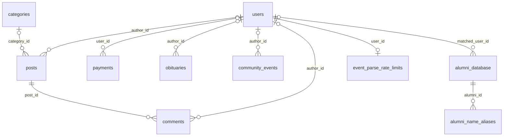
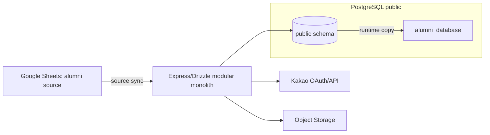

# 데이터베이스 스키마 기준서

이 문서는 행 데이터, 연결 문자열, 사용자·호스트명, Secret을 포함하지 않는 `public` 메타데이터 기준서다. 현재 권위는 코드 의도, 저장된 Development catalog와 2026-08-16에 재검증한 Production catalog다. Development의 현재 `public`에는 과거 기준보다 많은 비애플리케이션 객체가 함께 있어 전체 count는 Production과 직접 비교하지 않고, 이번 별칭 객체만 별도로 확인했다.

## 1. authority/verification metadata

| 항목 | 값 |
| --- | --- |
| code intent | `shared/schema.ts`의 13 `pgTable` + `server/index.ts` 런타임 `session` DDL |
| source identity frozen KST | `2026-07-27 14:46:56 KST +0900` |
| source identity frozen UTC | `2026-07-27 05:46:56 UTC +0000` |
| Development catalog verification start KST | `2026-07-27 16:25:11 KST +0900` |
| Development catalog verification start UTC | `2026-07-27 07:25:11 UTC +0000` |
| Development catalog verification end KST | `2026-07-27 16:25:13 KST +0900` |
| Development catalog verification end UTC | `2026-07-27 07:25:14 UTC +0000` |
| alias release candidate before schema-doc commit | `98bd8ea703838a59ae8b52e67180425c8aa01808` |
| Production catalog verification KST | `2026-08-16 18:28 KST +0900` |
| Production catalog verification UTC | `2026-08-16 09:28 UTC +0000` |
| code status | verified |
| Development catalog | historical app baseline verified; 2026-08-16 별칭 객체 verified, 전체 `public` count는 확장되어 별도 reconciliation 필요 |
| Production catalog | verified: `neondb`, PostgreSQL `16.10`, canonical read-only catalog completed |
| Production drift | alias release code intent와 일치 |
| 기준 count (tables/columns/PK/FK/non-PK UNIQUE/index/sequence) | `14/119/14/10/6/24/10` |
| catalog SQL SHA-256 | `7263c0736c96cbb3120252778b7adf8a463700ece8cd59b57be99cdb5fad757f` |
| Development evidence | local/uncommitted orchestration evidence: `.omo/evidence/current-db-schema-documentation/task-7-development-normalized-rerun.json`, `.omo/evidence/current-db-schema-documentation/task-7-development-summary-rerun.json`, `.omo/evidence/current-db-schema-documentation/task-7-development-rerun-receipt.md` |

Todo 1 source-identity의 local/Replit 동일 SHA-256: `shared/schema.ts=a105c8a37a83a2139676f315d0f62717da3c046ba283861e0ba5aba265f3db4b`; `server/index.ts=c2aa632ef79584ce9a6c7f8d2327505402eec6664dad70ec519cb5e01c161067`; `server/db.ts=65ff0fd353f6f32b4a69f005e27eba145e01c5daea506804a4104969c7665081`; `drizzle.config.ts=a08e0da1e6e514c8ac02019d4294478bd02b6f5c5778394ffa47b8ee2b2dd832`; `migrations/0000_cheerful_nick_fury.sql=45543022ded14b1744f1eb436ca0343ddeb207587d2d9b29b7af0c4c11c23f7a`; `migrations/meta/_journal.json=034c4e7521a5686d3ac2292e61a9cd3ec49fd632cc6596e615bbc72f7f67b848`; `docs/database-operations.md=3be0ef6178304804e00962b454621b5a4d00681760b92637c3580092529e22d0` (문서 작성 전 source baseline hash; final blob hash 아님).

위 Development evidence는 현재 실행의 local/uncommitted 감사 기록이며, future checkout에서 파일이 없더라도 verification failure를 뜻하지 않는다. 재검증의 권위는 tracked catalog SQL과 runbook이다.

Production은 additive transaction 적용 뒤 새 연결에서 별칭 테이블, 제약 4개, PK 포함 인덱스 4개, sequence를 확인했고 canonical metadata-only catalog가 `ROLLBACK`과 completion marker로 종료됐다. 별칭 데이터 검증은 행 내용을 기록하지 않고 대상 단일 일치, 별칭 2건, preferred 1건, 중복 0건, 원본 명부 보존 여부만 확인했다.

## 2. system and external boundaries

시스템은 Express/Drizzle 애플리케이션과 하나의 PostgreSQL `public` 스키마로 구성된 modular monolith이다. Google Sheets는 동문 명부 원본이고 `alumni_database`는 로그인·가입 심사용 runtime copy이며, Kakao는 OAuth/연결 해제 경계, Object Storage는 게시글·행사 첨부 경계다. 이 외부 시스템들은 물리 테이블을 소유하지 않는다.

`session`은 `server/index.ts`가 `CREATE TABLE IF NOT EXISTS` 및 `session_expire_idx`를 보장하는 runtime DDL이고 Drizzle migration 대상은 아니다. catalog SQL은 `public` 메타데이터만 읽고 행·PII·Secret을 읽지 않는다.

## 3. environment drift matrix

| object_kind | schema | physical_name | code_status | dev_status | prod_status | drift_note | evidence_ref |
| --- | --- | --- | --- | --- | --- | --- | --- |
| ordinary tables | public | baseline 14 | verified | 별칭 객체 verified; 전체 count 확장 | verified (14) | Production은 code intent와 일치 | 2026-08-16 catalog |
| columns | public | baseline 119 | verified | 별칭 7열 verified; 전체 count 확장 | verified (119) | Production은 code intent와 일치 | 2026-08-16 catalog |
| constraints/indexes/sequences | public | 14/10/6/24/10 | verified | 별칭 객체 verified | verified | Production은 code intent와 일치 | 2026-08-16 catalog |
| views | public | ABSENT (catalog count=0) | n/a | 현재 전체 상태 미분류 | ABSENT | Production verified | 2026-08-16 catalog |
| materialized views | public | ABSENT (catalog count=0) | n/a | 현재 전체 상태 미분류 | ABSENT | Production verified | 2026-08-16 catalog |
| triggers | public | ABSENT (catalog count=0) | n/a | 현재 전체 상태 미분류 | ABSENT | Production verified | 2026-08-16 catalog |
| policies | public | ABSENT (catalog count=0) | n/a | 현재 전체 상태 미분류 | ABSENT | Production verified | 2026-08-16 catalog |
| routines | public | ABSENT (catalog count=0) | n/a | 현재 전체 상태 미분류 | ABSENT | Production verified | 2026-08-16 catalog |
| enums | public | ABSENT (catalog count=0) | n/a | 현재 전체 상태 미분류 | ABSENT | Production verified | 2026-08-16 catalog |
| domains | public | ABSENT (catalog count=0) | n/a | 현재 전체 상태 미분류 | ABSENT | Production verified | 2026-08-16 catalog |

## 4. baseline ERD

ERD의 선은 catalog의 10 FK를 표현한다. nullable FK는 부모 쪽을 `o|`로 표시한다. `alumni_database.matched_user_id`는 FK이나 UNIQUE가 없어 물리 cardinality는 `users o|--o{ alumni_database`이고 1:1은 logical_only다. `community_events.legacy_obituary_id`는 UNIQUE이나 `obituaries` FK는 없다.

| FK constraint | ON UPDATE | ON DELETE |
| --- | --- | --- |
| `alumni_database_matched_user_id_users_id_fk` | NO ACTION | NO ACTION |
| `alumni_name_aliases_alumni_id_alumni_database_id_fk` | NO ACTION | CASCADE |
| `comments_author_id_users_id_fk` | NO ACTION | NO ACTION |
| `comments_post_id_posts_id_fk` | NO ACTION | CASCADE |
| `community_events_author_id_users_id_fk` | NO ACTION | NO ACTION |
| `event_parse_rate_limits_user_id_users_id_fk` | NO ACTION | CASCADE |
| `obituaries_author_id_users_id_fk` | NO ACTION | NO ACTION |
| `payments_user_id_users_id_fk` | NO ACTION | NO ACTION |
| `posts_author_id_users_id_fk` | NO ACTION | NO ACTION |
| `posts_category_id_categories_id_fk` | NO ACTION | NO ACTION |

## 5. per-table dictionary

모든 열은 `name:type NULL/NOT NULL default; identity/generated` 순서다. 명시하지 않은 `identity/generated`는 `none/none`이며, 별칭 테이블에만 명시한 CHECK 2개가 있다. 기존 행의 Development 검증 표기는 2026-07-27 app baseline을 뜻하며, Production은 2026-08-16 전체 catalog로 검증했다.

### TABLE_ROW: users

- physical name: `users`; code symbol: `users`; owner: Identity/Session; purpose: Kakao 회원 계정·권한·프로필.
- column/type/null/default/identity-generated: `id:integer NOT NULL nextval('users_id_seq'::regclass); none/none`; `kakao_id:text NULL none; none/none`; `email:text NOT NULL none; none/none`; `name:text NOT NULL none; none/none`; `graduation_year:integer NULL none; none/none`; `is_verified:boolean NULL false; none/none`; `is_admin:boolean NULL false; none/none`; `kakao_sync_enabled:boolean NULL false; none/none`; `profile_image:text NULL none; none/none`; `phone_number:text NULL none; none/none`; `created_at:timestamp without time zone NULL now(); none/none`; `updated_at:timestamp without time zone NULL now(); none/none`; `birthday:text NULL none; none/none`; `birthday_type:text NULL none; none/none`; `is_leap_month:boolean NULL none; none/none`; `activity_region:text NULL none; none/none`.
- PK/FK/UNIQUE/CHECK/index: PK `users_pkey(id)`; UNIQUE `users_email_unique(email)`, `users_kakao_id_unique(kakao_id)`; indexes `users_pkey`, `users_email_unique`, `users_kakao_id_unique`.
- physical/logical relations: posts/comments/payments/obituaries/community_events/alumni_database/event_parse_rate_limits의 FK 부모; alumni claim은 logical_only 1:1 기대.
- readers/writers: Kakao callback, 인증 middleware, profile/admin route가 읽기·쓰기. transaction/lifecycle: 가입 승인·거절·탈퇴에서 관련 테이블과 함께; 보존 정책 미정.
- PII class: direct identifier, contact, profile, authentication/security. retention evidence: 정책 미정. drift note: code/Development verified; Production unverified.

### TABLE_ROW: categories

- physical name: `categories`; code symbol: `categories`; owner: Community Content; purpose: 게시판 분류와 표시 순서.
- column/type/null/default/identity-generated: `id:integer NOT NULL nextval('categories_id_seq'::regclass); none/none`; `name:text NOT NULL none; none/none`; `display_name:text NOT NULL none; none/none`; `color:text NULL '#6b7280'::text; none/none`; `badge_variant:text NULL 'secondary'::text; none/none`; `is_active:boolean NULL true; none/none`; `sort_order:integer NULL 0; none/none`; `created_at:timestamp without time zone NULL now(); none/none`; `updated_at:timestamp without time zone NULL now(); none/none`.
- PK/FK/UNIQUE/CHECK/index: PK `categories_pkey(id)`; UNIQUE `categories_name_unique(name)`; indexes `categories_pkey`, `categories_name_unique`.
- physical/logical relations: `posts.category_id` FK 부모; visibility coupling은 logical_only. readers/writers: category CRUD/admin. transaction/lifecycle: seed와 admin CRUD, 보존 정책 미정.
- PII class: operational metadata. retention evidence: 정책 미정. drift note: code/Development verified; Production unverified.

### TABLE_ROW: posts

- physical name: `posts`; code symbol: `posts`; owner: Community Content; purpose: 게시글·첨부 경로.
- column/type/null/default/identity-generated: `id:integer NOT NULL nextval('posts_id_seq'::regclass); none/none`; `title:text NOT NULL none; none/none`; `content:text NOT NULL none; none/none`; `category_id:integer NULL none; none/none`; `author_id:integer NULL none; none/none`; `is_published:boolean NULL true; none/none`; `created_at:timestamp without time zone NULL now(); none/none`; `updated_at:timestamp without time zone NULL now(); none/none`; `image_urls:text[] NULL none; none/none`.
- PK/FK/UNIQUE/CHECK/index: PK `posts_pkey(id)`; FK `posts_author_id_users_id_fk(author_id→users.id NO ACTION)`, `posts_category_id_categories_id_fk(category_id→categories.id NO ACTION)`; index `posts_pkey`.
- physical/logical relations: comments의 부모이며 삭제 시 comments CASCADE; Object Storage 경로는 logical_only. readers/writers: public/community/admin route. transaction/lifecycle: post CRUD와 comment cascade; 첨부 GC 정책 미정.
- PII class: user content, direct identifier. retention evidence: 정책 미정. drift note: code/Development verified; Production unverified.

### TABLE_ROW: comments

- physical name: `comments`; code symbol: `comments`; owner: Community Content; purpose: 게시글 댓글.
- column/type/null/default/identity-generated: `id:integer NOT NULL nextval('comments_id_seq'::regclass); none/none`; `post_id:integer NOT NULL none; none/none`; `author_id:integer NULL none; none/none`; `content:text NOT NULL none; none/none`; `created_at:timestamp without time zone NULL now(); none/none`.
- PK/FK/UNIQUE/CHECK/index: PK `comments_pkey(id)`; FK `comments_author_id_users_id_fk(author_id→users.id NO ACTION)`, `comments_post_id_posts_id_fk(post_id→posts.id ON DELETE CASCADE)`; index `comments_pkey`.
- physical/logical relations: post parent, optional author. readers/writers: post detail/comment routes. transaction/lifecycle: post 삭제가 cascade; 사용자 삭제 정책 미정.
- PII class: user content, direct identifier. retention evidence: 정책 미정. drift note: code/Development verified; Production unverified.

### TABLE_ROW: payments

- physical name: `payments`; code symbol: `payments`; owner: Dues; purpose: 회비·결제 기록.
- column/type/null/default/identity-generated: `id:integer NOT NULL nextval('payments_id_seq'::regclass); none/none`; `user_id:integer NULL none; none/none`; `amount:integer NOT NULL none; none/none`; `year:integer NOT NULL none; none/none`; `type:text NOT NULL none; none/none`; `status:text NOT NULL 'completed'::text; none/none`; `receipt_url:text NULL none; none/none`; `created_at:timestamp without time zone NULL now(); none/none`.
- PK/FK/UNIQUE/CHECK/index: PK `payments_pkey(id)`; FK `payments_user_id_users_id_fk(user_id→users.id NO ACTION)`; index `payments_pkey`; UNIQUE 없음.
- physical/logical relations: receipt URL은 Object Storage logical_only. readers/writers: dues/admin 및 회원 납부 내역. transaction/lifecycle: create/update/read, 삭제 정책 미정.
- PII class: financial, direct identifier. retention evidence: 정책 미정. drift note: code/Development verified; Production unverified.

### TABLE_ROW: alumni_database

- physical name: `alumni_database`; code symbol: `alumniDatabase`; owner: Membership Registry/Onboarding; purpose: Google Sheets 명부의 runtime copy·claim 기준.
- column/type/null/default/identity-generated: `id:integer NOT NULL nextval('alumni_database_id_seq'::regclass); none/none`; `department:text NOT NULL none; none/none`; `generation:text NOT NULL none; none/none`; `name:text NOT NULL none; none/none`; `admission_date:text NULL none; none/none`; `graduation_date:text NULL none; none/none`; `address:text NULL none; none/none`; `mobile:text NULL none; none/none`; `phone:text NULL none; none/none`; `group:text NULL none; none/none`; `status:text NULL none; none/none`; `alumni_position:text NULL none; none/none`; `memo:text NULL none; none/none`; `is_matched:boolean NULL false; none/none`; `matched_user_id:integer NULL none; none/none`.
- PK/FK/UNIQUE/CHECK/index: PK `alumni_database_pkey(id)`; FK `alumni_database_matched_user_id_users_id_fk(matched_user_id→users.id NO ACTION)`; UNIQUE `alumni_database_mobile_unique(mobile)`; indexes `alumni_database_pkey`, `alumni_database_mobile_unique`.
- physical/logical relations: users claim, 그러나 `matched_user_id` UNIQUE 없음. readers/writers: admin sync preview/apply, onboarding claim. transaction/lifecycle: advisory lock + one transaction sync, 자동 삭제 없음.
- PII class: direct identifier, contact, profile, user content. retention evidence: 정책 미정. drift note: code/Development verified; Production unverified.

### TABLE_ROW: alumni_name_aliases

- physical name: `alumni_name_aliases`; code symbol: `alumniNameAliases`; owner: Membership Registry/Onboarding; purpose: 명부 원본 이름을 덮어쓰지 않고 검증된 현재 공식 이름·개명 전 이름을 보관해 관리자 경조사 대리등록의 이름+학번 단일 일치에 사용.
- column/type/null/default/identity-generated: `id:integer NOT NULL nextval('alumni_name_aliases_id_seq'::regclass); none/none`; `alumni_id:integer NOT NULL none; none/none`; `name:text NOT NULL none; none/none`; `normalized_name:text NOT NULL none; none/none`; `alias_type:text NOT NULL none; none/none`; `is_preferred:boolean NOT NULL false; none/none`; `created_at:timestamp without time zone NOT NULL now(); none/none`.
- PK/FK/UNIQUE/CHECK/index: PK `alumni_name_aliases_pkey(id)`; FK `alumni_name_aliases_alumni_id_alumni_database_id_fk(alumni_id→alumni_database.id ON DELETE CASCADE)`; CHECK `alumni_name_aliases_type_check`, `alumni_name_aliases_normalized_not_blank`; unique indexes `alumni_name_aliases_alumni_normalized_unique`, `alumni_name_aliases_preferred_unique`(partial); lookup index `alumni_name_aliases_normalized_idx`.
- physical/logical relations: 한 명의 동문은 여러 별칭을 가질 수 있지만 preferred는 최대 1건이고 동일 정규화 이름은 동문별 최대 1건이다. Google Sheets 복제 원본 `alumni_database.name`은 변경하지 않는다.
- readers/writers: 관리자 경조사 대리등록의 이름+학번 조회와 명시적 운영 transaction. 카카오 가입·로그인 명부 claim은 이 테이블을 읽지 않는다.
- PII class: direct identifier, profile. retention evidence: 명부 원본과 함께 관리하며 별도 기간은 정책 미정. drift note: code/Development object/Production catalog verified.

### TABLE_ROW: obituaries

- physical name: `obituaries`; code symbol: `obituaries`; owner: Community Events; purpose: legacy 경조사 게시물.
- column/type/null/default/identity-generated: `id:integer NOT NULL nextval('obituaries_id_seq'::regclass); none/none`; `title:text NOT NULL none; none/none`; `deceased_name:text NOT NULL none; none/none`; `deceased_relation:text NOT NULL none; none/none`; `date_of_death:text NOT NULL none; none/none`; `funeral_home:text NULL ''::text; none/none`; `jangji:text NULL ''::text; none/none`; `bank_account:text NULL ''::text; none/none`; `chief_mourner:text NULL ''::text; none/none`; `contact_number:text NULL ''::text; none/none`; `author_id:integer NULL none; none/none`; `created_at:timestamp without time zone NULL now(); none/none`.
- PK/FK/UNIQUE/CHECK/index: PK `obituaries_pkey(id)`; FK `obituaries_author_id_users_id_fk(author_id→users.id NO ACTION)`; index `obituaries_pkey`.
- physical/logical relations: `community_events.legacy_obituary_id`와 logical-only migration link. readers/writers: obituary/admin routes. transaction/lifecycle: CRUD·명시적 data migration, 삭제 정책 미정.
- PII class: user content, financial, contact, direct identifier. retention evidence: 정책 미정. drift note: code/Development verified; Production unverified.

### TABLE_ROW: community_events

- physical name: `community_events`; code symbol: `communityEvents`; owner: Community Events; purpose: 경조사·커뮤니티 이벤트 통합 모델.
- column/type/null/default/identity-generated: `id:integer NOT NULL nextval('community_events_id_seq'::regclass); none/none`; `legacy_obituary_id:integer NULL none; none/none`; `event_type:text NOT NULL none; none/none`; `status:text NOT NULL 'draft'::text; none/none`; `title:text NULL none; none/none`; `event_date:text NULL none; none/none`; `location:text NULL none; none/none`; `related_member_name:text NULL none; none/none`; `contact_number:text NULL none; none/none`; `account_info:text NULL none; none/none`; `source_text:text NULL none; none/none`; `source_urls:text[] NULL '{}'::text[]; none/none`; `details:jsonb NOT NULL '{}'::jsonb; none/none`; `author_id:integer NULL none; none/none`; `published_at:timestamp without time zone NULL none; none/none`; `created_at:timestamp without time zone NULL now(); none/none`; `updated_at:timestamp without time zone NULL now(); none/none`.
- PK/FK/UNIQUE/CHECK/index: PK `community_events_pkey(id)`; FK `community_events_author_id_users_id_fk(author_id→users.id NO ACTION)`; UNIQUE `community_events_legacy_obituary_id_unique(legacy_obituary_id)`; indexes `community_events_pkey`, `community_events_legacy_obituary_id_unique`.
- physical/logical relations: legacy obituary link은 FK 없음; source URL은 logical-only. readers/writers: event CRUD/parse/preview/admin. transaction/lifecycle: draft→published, parse quota 별도 원자적 갱신; 삭제 정책 미정.
- PII class: user content, contact, financial, operational metadata. retention evidence: 정책 미정. drift note: code/Development verified; Production unverified.

### TABLE_ROW: event_parse_rate_limits

- physical name: `event_parse_rate_limits`; code symbol: `eventParseRateLimits`; owner: Community Events; purpose: 회원별 공개 링크 파싱 quota.
- column/type/null/default/identity-generated: `user_id:integer NOT NULL none; none/none`; `window_started_at:timestamp with time zone NOT NULL now(); none/none`; `request_count:integer NOT NULL 0; none/none`; `updated_at:timestamp with time zone NOT NULL now(); none/none`.
- PK/FK/UNIQUE/CHECK/index: PK `event_parse_rate_limits_pkey(user_id)`; FK `event_parse_rate_limits_user_id_users_id_fk(user_id→users.id ON DELETE CASCADE)`; index `event_parse_rate_limits_pkey`.
- physical/logical relations: users one-per-user quota. readers/writers: event parser middleware/routes. transaction/lifecycle: atomic rolling-window update와 user deletion cascade.
- PII class: operational metadata, direct identifier. retention evidence: window policy는 코드 기반, 장기 보존 정책 미정. drift note: code/Development verified; Production unverified.

### TABLE_ROW: pending_registrations

- physical name: `pending_registrations`; code symbol: `pendingRegistrations`; owner: Membership Registry/Onboarding; purpose: 가입 심사 대기 payload.
- column/type/null/default/identity-generated: `id:integer NOT NULL nextval('pending_registrations_id_seq'::regclass); none/none`; `kakao_id:text NOT NULL none; none/none`; `email:text NOT NULL none; none/none`; `name:text NOT NULL none; none/none`; `user_data:jsonb NULL none; none/none`; `status:text NULL 'pending'::text; none/none`; `created_at:timestamp without time zone NULL now(); none/none`.
- PK/FK/UNIQUE/CHECK/index: PK `pending_registrations_pkey(id)`; FK/UNIQUE 없음; index `pending_registrations_pkey`.
- physical/logical relations: users/alumni 관계는 approval transaction의 logical_only 검증. readers/writers: login callback, admin approval/rejection. transaction/lifecycle: approval/rejection은 users/alumni와 atomic; 정책 미정.
- PII class: direct identifier, contact, profile, authentication/security. retention evidence: 정책 미정. drift note: code/Development verified; Production unverified.

### TABLE_ROW: kakao_oauth_states

- physical name: `kakao_oauth_states`; code symbol: `kakaoOAuthStates`; owner: Identity/Session; purpose: OAuth state replay/race 방지.
- column/type/null/default/identity-generated: `state_hash:text NOT NULL none; none/none`; `session_binding_hash:text NOT NULL none; none/none`; `expires_at:timestamp with time zone NOT NULL none; none/none`; `created_at:timestamp with time zone NOT NULL now(); none/none`; `started_at:timestamp with time zone NOT NULL now(); none/none`.
- PK/FK/UNIQUE/CHECK/index: PK `kakao_oauth_states_pkey(state_hash)`; UNIQUE `kakao_oauth_states_session_binding_hash_unique(session_binding_hash)`; indexes 같은 이름 2개.
- physical/logical relations: session binding은 logical_only. readers/writers: `/api/auth/kakao/start`, callback consume. transaction/lifecycle: issue/consume과 10분 만료·cleanup path.
- PII class: authentication/security, operational metadata. retention evidence: OAuth state 10분; 장기 정책 미정. drift note: runtime additive DDL, code/Development verified; Production unverified.

### TABLE_ROW: kakao_identity_terminations

- physical name: `kakao_identity_terminations`; code symbol: `kakaoIdentityTerminations`; owner: Identity/Session; purpose: Kakao 연결 해제 marker.
- column/type/null/default/identity-generated: `identity_hash:text NOT NULL none; none/none`; `terminated_at:timestamp with time zone NOT NULL now(); none/none`.
- PK/FK/UNIQUE/CHECK/index: PK `kakao_identity_terminations_pkey(identity_hash)`; index 같은 이름; FK/별도 UNIQUE 없음.
- physical/logical relations: Kakao identity logical-only, user FK 없음. readers/writers: account deletion/rejection admin route. transaction/lifecycle: marker upsert와 user deletion transaction.
- PII class: authentication/security, direct identifier (hashed). retention evidence: 정책 미정. drift note: runtime additive DDL, code/Development verified; Production unverified.

### TABLE_ROW: session

- physical name: `session`; code symbol: `PgSession runtime DDL`; owner: Identity/Session; purpose: express-session server-side session.
- column/type/null/default/identity-generated: `sid:character varying NOT NULL none; none/none`; `sess:json NOT NULL none; none/none`; `expire:timestamp(6) without time zone NOT NULL none; none/none`.
- PK/FK/UNIQUE/CHECK/index: PK `session_pkey(sid)`; standalone index `session_expire_idx(expire)`; FK/별도 UNIQUE 없음.
- physical/logical relations: `sess.userId`는 users를 향한 logical-only JSON reference. readers/writers: express-session middleware/pruning worker. transaction/lifecycle: cookie maxAge 7일, prune interval 60초.
- PII class: authentication/security, operational metadata, direct identifier inside opaque JSON. retention evidence: 7일 cookie/60초 pruning; 기타 정책 미정. drift note: runtime DDL, code/Development verified; Production unverified.

## 6. non-table objects

기존 13-table 행은 2026-07-27 Development saved catalog, 별칭 행과 Production 열은 2026-08-16 검증 기준이다. 현재 Development 전체 `public`은 앱 baseline 밖 객체가 섞여 있으므로 이번 문서에서는 그 전체 목록을 새로운 앱 기준으로 승격하지 않는다.

| category | Development object/status | Production |
| --- | --- | --- |
| ordinary/partitioned tables | historical app baseline 13 + `alumni_name_aliases`; 현재 전체 public count는 별도 reconciliation 필요 | ordinary 14, partitioned 없음; verified |
| views | historical ABSENT | ABSENT (catalog count=0) |
| materialized views | historical ABSENT | ABSENT (catalog count=0) |
| triggers | historical ABSENT | ABSENT (catalog count=0) |
| RLS/force-RLS | historical 13 tables false; 별칭 객체 확인 | 14 tables 모두 `rls_enabled=false`, `rls_forced=false` |
| policies | historical ABSENT | ABSENT (catalog count=0) |
| routines | historical ABSENT | ABSENT (catalog count=0) |
| enums | historical ABSENT | ABSENT (catalog count=0) |
| domains | historical ABSENT | ABSENT (catalog count=0); domain constraints ABSENT |
| extensions/dependencies | historical `plpgsql`; 현재 전체 상태 미분류 | `plpgsql` version `1.0`, public dependency ABSENT |
| sequences | historical 9 + `alumni_name_aliases_id_seq` | 10; catalog-valid |
| indexes/constraints | 별칭 객체의 PK/FK/CHECK/index verified | PK 14, FK 10, non-PK UNIQUE constraints 6, indexes 24; all catalog-valid/ready |

새 PK index는 `alumni_name_aliases_pkey`, 새 unique index는 `alumni_name_aliases_alumni_normalized_unique`와 partial `alumni_name_aliases_preferred_unique`, 새 lookup index는 `alumni_name_aliases_normalized_idx`다. 기존 PK·UNIQUE·standalone index 목록은 2026-07-27 baseline과 동일하다.

## 7. logical invariants

물리 강제는 PK/FK/UNIQUE/CASCADE와 별칭의 CHECK 2개다. 별칭은 `alias_type` 허용값과 빈 정규화 이름을 CHECK로 막고, partial unique index로 동문별 preferred 최대 1건을 보장한다. 다음은 logical_only다: `matched_user_id` 1:1 기대(UNIQUE 없음), pending `status` 및 payment/event `type/status`의 허용값, category/post visibility coupling, `legacy_obituary_id`의 obituary FK, Object Storage URL GC, 등록 승인·거절 중복 방지와 alumni claim 경쟁, `session.sess.userId`의 users 연결.

## 8. CRUD/transaction/lifecycle

가입 승인/거절은 `pending_registrations`, `users`, `alumni_database`를 한 transaction으로 다룬다. 계정 삭제는 Kakao termination marker, 세션, claim 해제, 콘텐츠·납부·행사 참조를 함께 처리한다. Google Sheets sync는 advisory lock + one transaction, OAuth state는 issue/consume + 10분 만료, session은 60초 pruning + 7일 cookie, event parse quota는 원자적 window update, post 삭제는 comments cascade다. 별칭 운영 변경은 이름+학번 단일 일치와 원본 이름 불변을 transaction 안에서 확인한다. 별도 보존 기간은 각 table row의 `정책 미정`을 따른다.

## 9. PII/retention

사용 분류는 direct identifier, contact, profile, authentication/security, financial, user content, operational metadata뿐이다. 실제 값은 기록하지 않는다. 명시된 수치 보존 근거는 OAuth state 10분, session cookie 7일, session pruning 60초뿐이며 나머지 행·첨부·명부 원본·탈퇴 데이터의 보존은 `정책 미정`이다.

## 10. ownership/cross-module transactions

| owner | tables |
| --- | --- |
| Identity/Session | `users`, `session`, `kakao_oauth_states`, `kakao_identity_terminations` |
| Membership Registry/Onboarding | `alumni_database`, `alumni_name_aliases`, `pending_registrations` |
| Community Content | `categories`, `posts`, `comments` |
| Dues | `payments` |
| Community Events | `obituaries`, `community_events`, `event_parse_rate_limits` |
| External Integrations | 물리 테이블 0; Google Sheets/Kakao/Object Storage 경계 |

registration/approval, account deletion, alumni claim/sync는 여러 owner의 테이블과 FK를 현재 한 DB transaction으로 묶는다. 이 표는 미래 API/write boundary 계약이며, 현재 별도 서비스가 이를 강제한다는 뜻은 아니다.

## 11. modular-monolith decision and extraction gate

현재 결정은 단일 PostgreSQL을 공유하는 modular monolith 유지다. 미래 추출은 다음 모두가 참일 때만 검토한다: 안정된 bounded context, 독립 scale/security/deployment 이득, 서비스 내부에서 닫히는 transaction, eventual consistency/compensation 수용, 독립 CI/CD·observability·incident ownership, data sovereignty. shared direct writes, 2PC/distributed transaction 필요, synchronous call chain, 불안정 boundary, 운영 ownership 부족 중 하나라도 있으면 NOT ELIGIBLE이다.

## 12. integrity risk register

| risk key | evidence-grounded gap | 영향/완화 |
| --- | --- | --- |
| R1 | `alumni_database.matched_user_id` non-UNIQUE | 1:1 claim 중복 가능; approval/sync transaction 유지와 제약 검토 |
| R2 | pending/payment/event 자유 text status/type | 허용값 drift; 코드 validation과 catalog를 분리 재검증 |
| R3 | manual user deletion lifecycle | orphan/PII 잔존; 정책 미정 |
| R4 | `legacy_obituary_id` UNIQUE, obituary FK 없음 | migration/link integrity를 logical_only로 추적 |
| R5 | category/post visibility coupling | inactive/published 불일치 가능 |
| R6 | Object Storage URL GC 없음 | orphan·retention 위험; 정책 미정 |
| R7 | checked-in six-table migration | 14-table current reproduction path 아님 |

## 13. migration drift

`migrations/0000_cheerful_nick_fury.sql`은 6-table historical incomplete baseline이며 현재 14-table reproduction path가 아니다. `session`은 runtime DDL, `kakao_oauth_states`·`kakao_identity_terminations`·`event_parse_rate_limits`·`alumni_name_aliases`는 additive operation, `seed-categories.sql`은 seed, `migrate-obituaries-to-community-events.sql`은 explicit data migration이다. Development의 기존 회계 테이블 때문에 `drizzle-kit push`가 위험한 rename 후보를 제시해 중단했고, 별칭 테이블은 문서화한 exact additive SQL transaction으로 양쪽 DB에 적용했다.

## 14. revalidation link/checklist

Canonical metadata-only SQL은 [`scripts/database-schema-catalog.sql`](../scripts/database-schema-catalog.sql)이며, 운영 절차는 [`docs/database-operations.md`](database-operations.md)의 **스키마 카탈로그 재검증**을 따른다. Development 기본 재검증은 Replit SSH에서 `psql -X --csv -v ON_ERROR_STOP=1 -v expected_database=heliumdb -f scripts/database-schema-catalog.sql`로 실행한다. Production은 연결 문자열을 명시적으로 선택하고 `expected_database=neondb` safety gate, `READ ONLY`, `ROLLBACK`, completion marker를 모두 확인한다.

체크리스트: 문서 14개 장의 고정 순서와 catalog 출력 18개 section의 고정 순서를 각각 확인하고, Production의 14 table row, 119 columns, 14 PK/10 FK/6 non-PK UNIQUE constraints/24 indexes/10 sequences, zero-count category, RLS false 14를 재확인한다. Development는 앱 baseline 밖 객체를 앱 스키마로 오인하지 않고 별도 reconciliation한다. 재검증은 metadata-only이고 결과의 행·PII·Secret을 저장하지 않는다.
