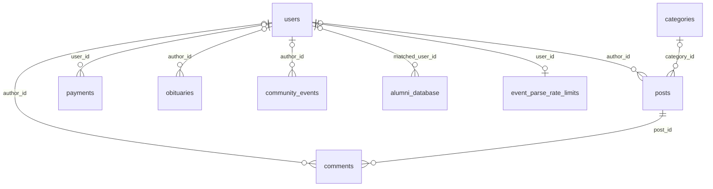
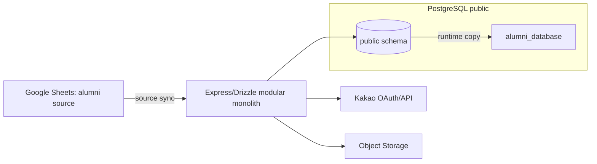

# 데이터베이스 스키마 기준서

이 문서는 행 데이터, 연결 문자열, 사용자·호스트명, Secret을 포함하지 않는 `public` 메타데이터 기준서다. 현재 권위는 코드 의도와 저장된 Development catalog뿐이며, Production은 미검증이다.

## 1. authority/verification metadata

| 항목 | 값 |
| --- | --- |
| code intent | `docs/database-manifest.yaml` + root-bound sequence `1,10,15,20,30,40,50,60` + child-bound sequence `70` + grandchild-bound sequence `80` + great-grandchild-bound sequence `90` + sequence-100 write fence |
| source identity frozen KST | `2026-07-27 14:46:56 KST +0900` |
| source identity frozen UTC | `2026-07-27 05:46:56 UTC +0000` |
| Development migrated verification KST | `2026-08-10 13:25 KST +0900` |
| Development migrated verification UTC | `2026-08-10 04:25 UTC +0000` |
| Todo 18 source-release verification KST | `2026-08-10 15:57 KST +0900` |
| Todo 18 first source-preview verification KST | `2026-08-10 16:53 KST +0900` |
| Todo 18 source-decision reader verification KST | `2026-08-10 17:41 KST +0900` |
| Todo 18 Notion role preflight KST | `2026-08-10 17:53 KST +0900` |
| Todo 18 Notion role v4 preview verification KST | `2026-08-10 18:15 KST +0900` |
| Todo 18 integrated-address-book v3 preview verification KST | `2026-08-10 18:50 KST +0900` |
| Todo 18 AGM36 boundary preview verification KST | `2026-08-10 19:04 KST +0900` |
| Todo 18 finalized-ledger v3 preview verification KST | `2026-08-10 19:26 KST +0900` |
| Todo 18 2026 bank-source preflight KST | `2026-08-10 19:35 KST +0900` |
| Todo 18 integrated disposable harness KST | `2026-08-11 08:08 KST +0900` |
| Todo 18 authenticated admin CLI apply KST | `2026-08-11 10:03 KST +0900` |
| Todo 18 AGM36 v3 apply verification KST | `2026-08-11 10:43 KST +0900` |
| Todo 18 foreign-faculty primary receipt preflight KST | `2026-08-11 10:52 KST +0900` |
| Todo 18 foreign-faculty quarantine apply verification KST | `2026-08-11 11:24 KST +0900` |
| Development sequence-70 verification KST | `2026-08-11 06:11 KST +0900` |
| Development sequence-80 verification KST | `2026-08-11 07:38 KST +0900` |
| Development sequence-90 verification KST | `2026-08-11 12:40 KST +0900` |
| Development sequence-100 verification KST | `2026-08-11 13:31 KST +0900` |
| Development sequence-110 verification KST | `2026-08-11 17:07 KST +0900` |
| Todo 19 zero-row cutover verification KST | `2026-08-11 15:03 KST +0900` |
| verified receipt commit | `0a6ea9e79b938301dfdfe917f0cbbd0a4ac3cf0c` |
| code status | verified |
| Development catalog | verified: `heliumdb`, PostgreSQL `16.10`, read-only catalog |
| Production catalog | unverified |
| Production drift | unknown |
| 기준 count (tables/columns/PK/FK/UNIQUE/CHECK/index/sequence/trigger/routine) | `68/1403/68/257/80/295/432/63/1/189` |
| manifest SHA-256 | `9dba0d10093ed9a070d4564d1bcc46e8ba3da47e4d39981d66792594737377ab` sequence-110 descendant (sequence-100 parent `551d9d672a0cd3689b6c3ac5d1252078f4e53106a7ef143ac954c96239596c14`; sequence-90 ancestor `19ac53ce74af375ab5eb6a9c96a3ca4d5fd7cc5127e9ad7bbd1da4cad33ea700`; sequence-80 ancestor `bf7216af6f30a366c0adad4b355fc6c4bed0aaf625154a70d063db2864d86b3b`; sequence-70 ancestor `31671836f8550190c38f27b15ec3d3e45e330e5fa3c256f3db48cdf059fe64f6`; root `986e515be4055393f13950844bb93dadd1ec1aa2b6484220506ded4f4ce6cef8`) |
| catalog SQL SHA-256 | `bd8a68cb4f200d78f1b8128c71132fd1e13fa1f863aa59529d767e8ec68594ec` |
| Development evidence | verified ledger `[1,10,15,20,30,40,50,60,70,80,90,100,110]`; sequence 110 `applied → verified_noop`, business-reason invalid rows 0, exact reason CHECK 8; legacy v3 release·zero-row preview·`legacy→fenced→new` five-service operation `created → verified_noop`; identity/receipt collection SHA 불변; legacy payment/decision `0/0`, cutover state 3, phase `new`, watermark 0 |
| Sequence-90 correction | all-version `legacy_cutover_states(cutover_code)` UNIQUE was replaced by the same-name `WHERE version=1` partial unique index; disposable and Development `applied → verified_noop`, same-code v1/v2 disposable insertion+`ROLLBACK`, startup/catalog approval, and zero cutover/payment/legacy-decision rows verified |
| Sequence-100 evidence | `payments`의 `legacy_payments_write_fence_v1` BEFORE INSERT/UPDATE/DELETE trigger와 `dgkma_guard_legacy_payments_write_v1()` routine을 Development에 적용했다. disposable에서 `legacy` write 허용+rollback, `fenced|new` SQLSTATE `55000` 거부, service 5작업 `created → verified_noop`, identity sequence 불변과 teardown `absent:true`를 증명했다. Development도 zero-row cutover를 완료해 기존 `payments` write authority는 차단되고 phase `new`가 운영 읽기 경계가 됐다. |
| Sequence-110 evidence | 승인된 physical business-reason registry의 8개 `reason_code NOT NULL` 열에 exact literal CHECK를 additive 적용했다. Development preflight의 비허용 행과 constraint 충돌은 모두 0이었고, disposable 및 Development가 각각 `applied → verified_noop`; metadata catalog는 `REPEATABLE READ READ ONLY → ROLLBACK`, disposable teardown은 `absent:true`였다. 이 sequence는 domain 폐쇄만 담당하며 action/status별 전이 검증은 Todo 20의 다음 단위다. |
| Development source/import state | verified read-only at `2026-08-11 15:03 KST`: logical source 10, active release 29 (`v1=10`, `v2=10`, `v3=8`, `v4=1`); import batch/decision set/item `11/10/6996`; batch `10 applied/1 previewed`, set `9 approved/1 rejected/0 previewed`; legacy batch row/source-decision/classification `0/0/0`; legacy operation receipt/entity/audit `5/6/6`; open period 6; legacy payments/decisions `0/0`; transaction terminal `ROLLBACK` |

Todo 1 source-identity의 local/Replit 동일 SHA-256: `shared/schema.ts=a105c8a37a83a2139676f315d0f62717da3c046ba283861e0ba5aba265f3db4b`; `server/index.ts=c2aa632ef79584ce9a6c7f8d2327505402eec6664dad70ec519cb5e01c161067`; `server/db.ts=65ff0fd353f6f32b4a69f005e27eba145e01c5daea506804a4104969c7665081`; `drizzle.config.ts=a08e0da1e6e514c8ac02019d4294478bd02b6f5c5778394ffa47b8ee2b2dd832`; `migrations/0000_cheerful_nick_fury.sql=45543022ded14b1744f1eb436ca0343ddeb207587d2d9b29b7af0c4c11c23f7a`; `migrations/meta/_journal.json=034c4e7521a5686d3ac2292e61a9cd3ec49fd632cc6596e615bbc72f7f67b848`; `docs/database-operations.md=3be0ef6178304804e00962b454621b5a4d00681760b92637c3580092529e22d0` (문서 작성 전 source baseline hash; final blob hash 아님).

위 Development evidence는 현재 실행의 local/uncommitted 감사 기록이며, future checkout에서 파일이 없더라도 verification failure를 뜻하지 않는다. 재검증의 권위는 tracked catalog SQL과 runbook이다.

Production의 성공 catalog가 없으므로 Production schema, Development와의 일치, Production drift 유무를 주장하지 않는다.

Todo 19 nonzero materialization과 read rollback은 sequence-100 schema를 변경하지 않는 application-service 작업이다. Exact commit `a6944d1`의 disposable happy run은 decision 5, legacy compatibility event/receipt/allocation 각 1, 최종 phase `new`, 고정 operation 및 read rollback/recutover replay no-op를 증명했다. ambiguity와 concurrent-writer run은 각각 business residue 0으로 rollback했고 모든 disposable DB가 `absent:true`였다. Development의 verified zero-row 상태와 이 문서의 catalog 수치는 그대로다.

Todo 18의 첫 checkpoint에서 승인된 deferred source 8개의 v1 immutable release를 Development에 추가했다. 이후 owner가 관리자 가독형 source snapshot과 secretless domain-separated SHA-256, stable `member_uid` 경계를 승인해 10개 logical source 각각에 v2 immutable release를 append했다. 기존 release는 모두 immutable 이력으로 보존한다. 비개인정보 정책 source 2개는 durable zero-item preview이며 downstream policy row를 만들지 않았다. Notion role v4 90행과 통합주소록 v3 3,458행은 name-only `quarantine`, AGM36 경계 2행은 `period_materialization:approve`, 확정 회계원장 v3은 `classification:quarantine` 3,014행과 달력 경계 `approve` 4행으로 preview됐다. Toss v3 200행과 IBK v3 174행은 전부 classification quarantine이고, 외래교수회 v3은 name-only match 26개와 primary receipt 미결합 allocation 26개를 quarantine했다. Apply 전 2026-08-11 read-only 집계는 active release 27, batch/set/item `9/9/6994`; 모든 batch/set은 `previewed`이며 제안 outcome은 approve 6, quarantine 6,988, reject 0이었다. 회원·match·직책·분류·event·receipt·allocation downstream은 모두 0이다. 외래교수회 26행 × 50,000원은 계속 candidate-only이고 exact primary bank receipt equality 전에는 배분하지 않는다. `ACCOUNTING_PII_HMAC_KEY_V1`은 생성하거나 사용하지 않았다.

2026-08-11 Todo 18 group-apply 구현 checkpoint에서는 primary/companion의 잠긴 row normalization version, match evidence, roster batch ID와 category label을 materialization plan에 명시적으로 결합했다. 신규 identity row와 audit row 예약은 canonical result ordinal에 맞춘 phase `0→10→30` 순서이며, 실제 `pg_get_serial_sequence` 결과를 hashed receipt projection에 보존한다. 신규/기존 group party부터 bank transaction까지의 즉시-FK source spine 실행기는 구현되어 Replit 24개 집중 테스트와 `npx tsc --noEmit`을 통과했다. 이 코드는 아직 source-decision service에 연결되지 않았고 financial/member graph, audit/receipt atomic wiring과 disposable commit probe가 남아 있으므로 Development business row와 기존 preview 상태는 변경되지 않았다.

후속 exact commit `774428f`에서는 primary+companion multi-batch group apply를 source-decision service에 연결하고 전체 financial/member graph와 audit receipt를 원자적으로 materialize했다. Fresh disposable run `3f9e8c71-7d4a-4d25-9f2c-0b1a8e6d7c43`은 승인 set/batch `2/2`, party부터 allocation까지 계약된 downstream 수량, operation receipt/entity/audit `1/28/28`, KRW 50,000 합계, 동일 apply의 `verified_noop`과 identity-sequence 불변을 증명한 뒤 DB·actor receipt·임시 worktree 부재를 확인했다. 이어 Development에는 business/source-decision row를 만들지 않고 sequence 80만 `applied → verified_noop`으로 반영했다. 기존 all-version group-member source UNIQUE constraint는 0개이고 동일 이름의 `WHERE (version = 1)` partial unique index는 정확히 1개이며, startup과 read-only catalog `ROLLBACK`이 승인됐다.

Exact commit `c3678d8`의 Todo 18 통합 harness는 Replit에서 `npx tsc --noEmit`을 통과한 뒤 8개 독립 disposable DB를 사용했다. Happy lane 6개는 reject→repreview→GET→approve, zero-child supersede, 기간 생성, Notion 직책 materialization, 개별 회비 materialization, primary+companion group materialization을 검증했다. Failure lane 2개는 incomplete replacement coverage와 allocation insert 시점의 강제 late failure를 각각 거부해 원상태 및 cross-batch partial commit 0을 증명했다. 모든 lane은 exact replay 또는 rollback, Production operation 0, DB·actor receipt·임시 worktree/evidence 부재를 확인했다. 이 합성 검증은 실제 9개 Development preview를 승인하거나 apply하지 않았다.

Exact commit `d6f1788`의 authenticated administrator CLI는 fixed Development admin receipt와 live ledger/admin state를 재검증한 뒤 HTTP POST와 동일한 application service·SERIALIZABLE transaction을 호출한다. Replit `tsc`와 138개 집중 테스트를 통과했고, 실제 Development에서 결함 없는 7개 source를 apply한 뒤 동일 operation replay의 receipt bytes와 identity-sequence digest 불변을 확인했다. 최종 상태는 해당 batch/set `7/7 applied/approved`, open period `CALENDAR_2022`–`CALENDAR_2025` 4개, operation receipt/entity/audit `7/18/18`, 나머지 business downstream 0이다. AGM36 v2는 활성 Notion v4에 존재하지 않는 boundary coordinate/content digest 때문에 reservation 전 `source_decision_period_boundary_mismatch`로 원자 rollback됐고 receipt 0이다. 외래교수회는 primary bank receipt가 미결합되어 계속 previewed다.

Owner가 승인한 AGM36 v3는 기존 v2 release·preview를 보존하고 활성 Notion v4의 실제 22대 회장 경계 row에 새 mapping/release를 결합했다. Exact commit `9a2a89d`에서 Replit `tsc`와 135개 집중 테스트, Notion boundary 1행 read-only 검증, release·preview `created → verified_noop`을 통과했다. 관리자 CLI는 v2 set을 reject한 뒤 v3 set만 approve/apply해 `PRE_AGM36_2026`, `AGM36_TO_AGM37` 두 period를 생성했다. 최종 상태는 v2 set/batch `rejected/previewed`, v3 set/batch `approved/applied`, 전체 open period 6, reject operation `1/1/1`, approve operation `1/4/4`, member/financial downstream 0이다. Exact replay의 receipt bytes와 identity-sequence digest가 동일했고 모든 검증 transaction은 `ROLLBACK`으로 끝났다.

Exact commit `1aff7e1`의 PII-minimized read-only preflight는 foreign-faculty roster 합계 KRW 1,300,000을 재현했지만, 같은 금액의 eligible credit row를 Toss·IBK v3와 finalized-ledger v3 모두에서 0개 확인했다. 이 source는 계속 batch/set `previewed/previewed`, row/item `26/52`이고 downstream은 0이다. Primary receipt가 없으므로 group allocation apply는 금지 상태다.

Owner가 승인한 보수적 terminal decision으로 foreign-faculty set `811462f6-de04-428b-99ba-a587eac4b0d7`의 name-only match 26개와 unbound allocation 26개를 기존 `quarantine` outcome 그대로 Development에 approve/apply했다. Exact replay는 동일 service receipt·file bytes를 반환했고 identity-sequence digest는 `c0b7dd1d1343026d74c4c897f57ce5a8df086c5482541e9a8f2bd8a9bba25778`로 불변이었다. 최종 read-only verifier는 set/batch `approved/applied`, quarantine `26/26`, source-decision receipt/entity/audit `1/2/2`, 전체 batch `9 applied/1 previewed`, set `9 approved/1 rejected`, 회원·financial·group downstream 0, terminal `ROLLBACK`을 입증했다. 향후 실제 bank evidence는 새 source revision/release/preview와 별도 source-decision으로만 처리한다.

2026 은행 source의 bounded reader는 계좌번호·CMS 열을 읽지 않은 채 Toss 200개 거래행과 IBK 174개 거래행을 구조 검증했다. IBK 2행은 날짜·출금·입금·잔액만 있고 비영 단일방향 금액과 표시 설명이 없는 opening-balance/anchor evidence이므로 경제 이벤트로 추정하지 않는다. 재현 불가능한 v2 header hash는 immutable v3 profile/map으로 교정했고 두 v3 release와 quarantine preview는 `created → verified_noop`을 통과했다. 실제 bank classification apply는 0건이다.

## 2. system and external boundaries

시스템은 Express/Drizzle 애플리케이션과 하나의 PostgreSQL `public` 스키마로 구성된 modular monolith이다. Google Sheets는 동문 명부 원본이고 `alumni_database`는 로그인·가입 심사용 runtime copy이며, Kakao는 OAuth/연결 해제 경계, Object Storage는 게시글·행사 첨부 경계다. 이 외부 시스템들은 물리 테이블을 소유하지 않는다.

`session`을 포함한 required schema는 migration ledger가 소유한다. 현재 Development ledger는 root-bound 1→60, child-bound 70, grandchild-bound 80, great-grandchild-bound 90, sequence-100 descendant의 exact lineage를 보유하며, 시작 경로는 이를 검증할 뿐 DDL을 방출하지 않는다. catalog SQL은 `public` 메타데이터만 읽고 행·PII·Secret을 읽지 않는다.

## 3. environment drift matrix

| object_kind | schema | physical_name | code_status | dev_status | prod_status | drift_note | evidence_ref |
| --- | --- | --- | --- | --- | --- | --- | --- |
| ordinary tables | public | manifest + baseline 68 | verified | verified (68) | unverified | Production 비교 불가 | Todo 17 |
| columns | public | 1403 | verified | verified (1403) | unverified | Production 비교 불가 | Todo 17 |
| constraints/indexes/sequences | public | PK 68/FK 257/UNIQUE 80/CHECK 287/index 432/sequence 63 | verified | verified | unverified | Production 비교 불가 | Todo 17 |
| views | public | ABSENT (catalog count=0) | n/a | ABSENT (catalog count=0) | unverified | Production 부재 추정 금지 | Todo 7 rerun |
| materialized views | public | ABSENT (catalog count=0) | n/a | ABSENT (catalog count=0) | unverified | Production 부재 추정 금지 | Todo 7 rerun |
| triggers | public | `legacy_payments_write_fence_v1` | verified | verified (1) | unverified | Production 부재 추정 금지 | Todo 19 |
| policies | public | ABSENT (catalog count=0) | n/a | ABSENT (catalog count=0) | unverified | Production 부재 추정 금지 | Todo 7 rerun |
| routines | public | manifest-owned functions 189 | verified | verified (189) | unverified | Production 비교 불가 | Todo 19 |
| enums | public | ABSENT (catalog count=0) | n/a | ABSENT (catalog count=0) | unverified | Production 부재 추정 금지 | Todo 7 rerun |
| domains | public | ABSENT (catalog count=0) | n/a | ABSENT (catalog count=0) | unverified | Production 부재 추정 금지 | Todo 7 rerun |

## 4. baseline application-subset ERD

이 ERD는 기존 홈페이지 13-table subset만 표시한다. 최종 257 FK와 회계·회비·출처·감사 관계의 상세 권위는 manifest다. Sequence 20은 `alumni_database.matched_user_id`의 non-null uniqueness와 `community_events.legacy_obituary_id → obituaries.id`를 물리적으로 강제한다.

| FK constraint | ON UPDATE | ON DELETE |
| --- | --- | --- |
| `alumni_database_matched_user_id_users_id_fk` | NO ACTION | NO ACTION |
| `comments_author_id_users_id_fk` | NO ACTION | NO ACTION |
| `comments_post_id_posts_id_fk` | NO ACTION | CASCADE |
| `community_events_author_id_users_id_fk` | NO ACTION | NO ACTION |
| `event_parse_rate_limits_user_id_users_id_fk` | NO ACTION | CASCADE |
| `obituaries_author_id_users_id_fk` | NO ACTION | NO ACTION |
| `payments_user_id_users_id_fk` | NO ACTION | NO ACTION |
| `posts_author_id_users_id_fk` | NO ACTION | NO ACTION |
| `posts_category_id_categories_id_fk` | NO ACTION | NO ACTION |

## 5. per-table dictionary

아래 13개 row는 기존 홈페이지 application subset의 역할·PII·lifecycle 설명을 보존한다. 최종 물리 column/constraint 정의는 manifest가 권위이며, Todo 17 overlay는 다음과 같다.

| existing table | migrated overlay |
| --- | --- |
| `users` | immutable `user_uid`, generated canonical email/phone, exact canonical CHECK/UNIQUE/index |
| `alumni_database` | generated canonical mobile, non-null matched-user uniqueness/index |
| `pending_registrations` | generated canonical email, status/domain and pending identity partial uniqueness |
| `categories` | badge-variant and nonnegative sort-order CHECK |
| `payments` | amount/year/type/status CHECK; sequence 100 이후 latest `payments-v1` cutover phase가 `legacy`일 때만 write 가능 |
| `community_events` | event type/status CHECK와 nullable obituary FK `ON DELETE SET NULL ON UPDATE RESTRICT` |
| `event_parse_rate_limits` | nonnegative count 및 timestamp ordering CHECK |
| `kakao_oauth_states` | expiry-after-start CHECK |

나머지 manifest-owned 55개 table의 1286 columns, keys, audit/transition routines와 관계는 [`database-manifest.yaml`](database-manifest.yaml)의 closed registry가 상세 권위다. 아래 기존 row에서 `CHECK 없음` 또는 pre-Todo-17 relation 표기는 historical baseline 설명이며 최종 catalog 주장으로 사용하지 않는다. Production은 전부 unverified다.

### TABLE_ROW: users

- physical name: `users`; code symbol: `users`; owner: Identity/Session; purpose: Kakao 회원 계정·권한·프로필.
- column/type/null/default/identity-generated: `id:integer NOT NULL nextval('users_id_seq'::regclass); none/none`; `kakao_id:text NULL none; none/none`; `email:text NOT NULL none; none/none`; `name:text NOT NULL none; none/none`; `graduation_year:integer NULL none; none/none`; `is_verified:boolean NULL false; none/none`; `is_admin:boolean NULL false; none/none`; `kakao_sync_enabled:boolean NULL false; none/none`; `profile_image:text NULL none; none/none`; `phone_number:text NULL none; none/none`; `created_at:timestamp without time zone NULL now(); none/none`; `updated_at:timestamp without time zone NULL now(); none/none`; `birthday:text NULL none; none/none`; `birthday_type:text NULL none; none/none`; `is_leap_month:boolean NULL none; none/none`; `activity_region:text NULL none; none/none`.
- PK/FK/UNIQUE/CHECK/index: PK `users_pkey(id)`; UNIQUE `users_email_unique(email)`, `users_kakao_id_unique(kakao_id)`; indexes `users_pkey`, `users_email_unique`, `users_kakao_id_unique`.
- physical/logical relations: posts/comments/payments/obituaries/community_events/alumni_database/event_parse_rate_limits의 FK 부모; alumni claim은 logical_only 1:1 기대.
- readers/writers: Kakao callback, 인증 middleware, profile/admin route가 읽기·쓰기. transaction/lifecycle: 가입 승인·거절·탈퇴에서 관련 테이블과 함께; 보존 정책 미정.
- PII class: direct identifier, contact, profile, authentication/security. retention evidence: 정책 미정. drift note: code/Development verified; Production unverified.

### TABLE_ROW: categories

- physical name: `categories`; code symbol: `categories`; owner: Community Content; purpose: 게시판 분류와 표시 순서.
- column/type/null/default/identity-generated: `id:integer NOT NULL nextval('categories_id_seq'::regclass); none/none`; `name:text NOT NULL none; none/none`; `display_name:text NOT NULL none; none/none`; `color:text NULL '#6b7280'::text; none/none`; `badge_variant:text NULL 'secondary'::text; none/none`; `is_active:boolean NULL true; none/none`; `sort_order:integer NULL 0; none/none`; `created_at:timestamp without time zone NULL now(); none/none`; `updated_at:timestamp without time zone NULL now(); none/none`.
- PK/FK/UNIQUE/CHECK/index: PK `categories_pkey(id)`; UNIQUE `categories_name_unique(name)`; indexes `categories_pkey`, `categories_name_unique`.
- physical/logical relations: `posts.category_id` FK 부모; visibility coupling은 logical_only. readers/writers: category CRUD/admin. transaction/lifecycle: seed와 admin CRUD, 보존 정책 미정.
- PII class: operational metadata. retention evidence: 정책 미정. drift note: code/Development verified; Production unverified.

### TABLE_ROW: posts

- physical name: `posts`; code symbol: `posts`; owner: Community Content; purpose: 게시글·첨부 경로.
- column/type/null/default/identity-generated: `id:integer NOT NULL nextval('posts_id_seq'::regclass); none/none`; `title:text NOT NULL none; none/none`; `content:text NOT NULL none; none/none`; `category_id:integer NULL none; none/none`; `author_id:integer NULL none; none/none`; `is_published:boolean NULL true; none/none`; `created_at:timestamp without time zone NULL now(); none/none`; `updated_at:timestamp without time zone NULL now(); none/none`; `image_urls:text[] NULL none; none/none`.
- PK/FK/UNIQUE/CHECK/index: PK `posts_pkey(id)`; FK `posts_author_id_users_id_fk(author_id→users.id NO ACTION)`, `posts_category_id_categories_id_fk(category_id→categories.id NO ACTION)`; index `posts_pkey`.
- physical/logical relations: comments의 부모이며 삭제 시 comments CASCADE; Object Storage 경로는 logical_only. readers/writers: public/community/admin route. transaction/lifecycle: post CRUD와 comment cascade; 첨부 GC 정책 미정.
- PII class: user content, direct identifier. retention evidence: 정책 미정. drift note: code/Development verified; Production unverified.

### TABLE_ROW: comments

- physical name: `comments`; code symbol: `comments`; owner: Community Content; purpose: 게시글 댓글.
- column/type/null/default/identity-generated: `id:integer NOT NULL nextval('comments_id_seq'::regclass); none/none`; `post_id:integer NOT NULL none; none/none`; `author_id:integer NULL none; none/none`; `content:text NOT NULL none; none/none`; `created_at:timestamp without time zone NULL now(); none/none`.
- PK/FK/UNIQUE/CHECK/index: PK `comments_pkey(id)`; FK `comments_author_id_users_id_fk(author_id→users.id NO ACTION)`, `comments_post_id_posts_id_fk(post_id→posts.id ON DELETE CASCADE)`; index `comments_pkey`.
- physical/logical relations: post parent, optional author. readers/writers: post detail/comment routes. transaction/lifecycle: post 삭제가 cascade; 사용자 삭제 정책 미정.
- PII class: user content, direct identifier. retention evidence: 정책 미정. drift note: code/Development verified; Production unverified.

### TABLE_ROW: payments

- physical name: `payments`; code symbol: `payments`; owner: Dues; purpose: 회비·결제 기록.
- column/type/null/default/identity-generated: `id:integer NOT NULL nextval('payments_id_seq'::regclass); none/none`; `user_id:integer NULL none; none/none`; `amount:integer NOT NULL none; none/none`; `year:integer NOT NULL none; none/none`; `type:text NOT NULL none; none/none`; `status:text NOT NULL 'completed'::text; none/none`; `receipt_url:text NULL none; none/none`; `created_at:timestamp without time zone NULL now(); none/none`.
- PK/FK/UNIQUE/CHECK/index: PK `payments_pkey(id)`; FK `payments_user_id_users_id_fk(user_id→users.id NO ACTION)`; index `payments_pkey`; UNIQUE 없음.
- physical/logical relations: receipt URL은 Object Storage logical_only. readers/writers: dues/admin 및 회원 납부 내역. transaction/lifecycle: create/update/read, 삭제 정책 미정.
- PII class: financial, direct identifier. retention evidence: 정책 미정. drift note: code/Development verified; Production unverified.

### TABLE_ROW: alumni_database

- physical name: `alumni_database`; code symbol: `alumniDatabase`; owner: Membership Registry/Onboarding; purpose: Google Sheets 명부의 runtime copy·claim 기준.
- column/type/null/default/identity-generated: `id:integer NOT NULL nextval('alumni_database_id_seq'::regclass); none/none`; `department:text NOT NULL none; none/none`; `generation:text NOT NULL none; none/none`; `name:text NOT NULL none; none/none`; `admission_date:text NULL none; none/none`; `graduation_date:text NULL none; none/none`; `address:text NULL none; none/none`; `mobile:text NULL none; none/none`; `phone:text NULL none; none/none`; `group:text NULL none; none/none`; `status:text NULL none; none/none`; `alumni_position:text NULL none; none/none`; `memo:text NULL none; none/none`; `is_matched:boolean NULL false; none/none`; `matched_user_id:integer NULL none; none/none`.
- PK/FK/UNIQUE/CHECK/index: PK `alumni_database_pkey(id)`; FK `alumni_database_matched_user_id_users_id_fk(matched_user_id→users.id NO ACTION)`; UNIQUE `alumni_database_mobile_unique(mobile)`; indexes `alumni_database_pkey`, `alumni_database_mobile_unique`.
- physical/logical relations: users claim, 그러나 `matched_user_id` UNIQUE 없음. readers/writers: admin sync preview/apply, onboarding claim. transaction/lifecycle: advisory lock + one transaction sync, 자동 삭제 없음.
- PII class: direct identifier, contact, profile, user content. retention evidence: 정책 미정. drift note: code/Development verified; Production unverified.

### TABLE_ROW: obituaries

- physical name: `obituaries`; code symbol: `obituaries`; owner: Community Events; purpose: legacy 경조사 게시물.
- column/type/null/default/identity-generated: `id:integer NOT NULL nextval('obituaries_id_seq'::regclass); none/none`; `title:text NOT NULL none; none/none`; `deceased_name:text NOT NULL none; none/none`; `deceased_relation:text NOT NULL none; none/none`; `date_of_death:text NOT NULL none; none/none`; `funeral_home:text NULL ''::text; none/none`; `jangji:text NULL ''::text; none/none`; `bank_account:text NULL ''::text; none/none`; `chief_mourner:text NULL ''::text; none/none`; `contact_number:text NULL ''::text; none/none`; `author_id:integer NULL none; none/none`; `created_at:timestamp without time zone NULL now(); none/none`.
- PK/FK/UNIQUE/CHECK/index: PK `obituaries_pkey(id)`; FK `obituaries_author_id_users_id_fk(author_id→users.id NO ACTION)`; index `obituaries_pkey`.
- physical/logical relations: `community_events.legacy_obituary_id`와 logical-only migration link. readers/writers: obituary/admin routes. transaction/lifecycle: CRUD·명시적 data migration, 삭제 정책 미정.
- PII class: user content, financial, contact, direct identifier. retention evidence: 정책 미정. drift note: code/Development verified; Production unverified.

### TABLE_ROW: community_events

- physical name: `community_events`; code symbol: `communityEvents`; owner: Community Events; purpose: 경조사·커뮤니티 이벤트 통합 모델.
- column/type/null/default/identity-generated: `id:integer NOT NULL nextval('community_events_id_seq'::regclass); none/none`; `legacy_obituary_id:integer NULL none; none/none`; `event_type:text NOT NULL none; none/none`; `status:text NOT NULL 'draft'::text; none/none`; `title:text NULL none; none/none`; `event_date:text NULL none; none/none`; `location:text NULL none; none/none`; `related_member_name:text NULL none; none/none`; `contact_number:text NULL none; none/none`; `account_info:text NULL none; none/none`; `source_text:text NULL none; none/none`; `source_urls:text[] NULL '{}'::text[]; none/none`; `details:jsonb NOT NULL '{}'::jsonb; none/none`; `author_id:integer NULL none; none/none`; `published_at:timestamp without time zone NULL none; none/none`; `created_at:timestamp without time zone NULL now(); none/none`; `updated_at:timestamp without time zone NULL now(); none/none`.
- PK/FK/UNIQUE/CHECK/index: PK `community_events_pkey(id)`; FK `community_events_author_id_users_id_fk(author_id→users.id NO ACTION)`; UNIQUE `community_events_legacy_obituary_id_unique(legacy_obituary_id)`; indexes `community_events_pkey`, `community_events_legacy_obituary_id_unique`.
- physical/logical relations: legacy obituary link은 FK 없음; source URL은 logical-only. readers/writers: event CRUD/parse/preview/admin. transaction/lifecycle: draft→published, parse quota 별도 원자적 갱신; 삭제 정책 미정.
- PII class: user content, contact, financial, operational metadata. retention evidence: 정책 미정. drift note: code/Development verified; Production unverified.

### TABLE_ROW: event_parse_rate_limits

- physical name: `event_parse_rate_limits`; code symbol: `eventParseRateLimits`; owner: Community Events; purpose: 회원별 공개 링크 파싱 quota.
- column/type/null/default/identity-generated: `user_id:integer NOT NULL none; none/none`; `window_started_at:timestamp with time zone NOT NULL now(); none/none`; `request_count:integer NOT NULL 0; none/none`; `updated_at:timestamp with time zone NOT NULL now(); none/none`.
- PK/FK/UNIQUE/CHECK/index: PK `event_parse_rate_limits_pkey(user_id)`; FK `event_parse_rate_limits_user_id_users_id_fk(user_id→users.id ON DELETE CASCADE)`; index `event_parse_rate_limits_pkey`.
- physical/logical relations: users one-per-user quota. readers/writers: event parser middleware/routes. transaction/lifecycle: atomic rolling-window update와 user deletion cascade.
- PII class: operational metadata, direct identifier. retention evidence: window policy는 코드 기반, 장기 보존 정책 미정. drift note: code/Development verified; Production unverified.

### TABLE_ROW: pending_registrations

- physical name: `pending_registrations`; code symbol: `pendingRegistrations`; owner: Membership Registry/Onboarding; purpose: 가입 심사 대기 payload.
- column/type/null/default/identity-generated: `id:integer NOT NULL nextval('pending_registrations_id_seq'::regclass); none/none`; `kakao_id:text NOT NULL none; none/none`; `email:text NOT NULL none; none/none`; `name:text NOT NULL none; none/none`; `user_data:jsonb NULL none; none/none`; `status:text NULL 'pending'::text; none/none`; `created_at:timestamp without time zone NULL now(); none/none`.
- PK/FK/UNIQUE/CHECK/index: PK `pending_registrations_pkey(id)`; FK/UNIQUE 없음; index `pending_registrations_pkey`.
- physical/logical relations: users/alumni 관계는 approval transaction의 logical_only 검증. readers/writers: login callback, admin approval/rejection. transaction/lifecycle: approval/rejection은 users/alumni와 atomic; 정책 미정.
- PII class: direct identifier, contact, profile, authentication/security. retention evidence: 정책 미정. drift note: code/Development verified; Production unverified.

### TABLE_ROW: kakao_oauth_states

- physical name: `kakao_oauth_states`; code symbol: `kakaoOAuthStates`; owner: Identity/Session; purpose: OAuth state replay/race 방지.
- column/type/null/default/identity-generated: `state_hash:text NOT NULL none; none/none`; `session_binding_hash:text NOT NULL none; none/none`; `expires_at:timestamp with time zone NOT NULL none; none/none`; `created_at:timestamp with time zone NOT NULL now(); none/none`; `started_at:timestamp with time zone NOT NULL now(); none/none`.
- PK/FK/UNIQUE/CHECK/index: PK `kakao_oauth_states_pkey(state_hash)`; UNIQUE `kakao_oauth_states_session_binding_hash_unique(session_binding_hash)`; indexes 같은 이름 2개.
- physical/logical relations: session binding은 logical_only. readers/writers: `/api/auth/kakao/start`, callback consume. transaction/lifecycle: issue/consume과 10분 만료·cleanup path.
- PII class: authentication/security, operational metadata. retention evidence: OAuth state 10분; 장기 정책 미정. drift note: runtime additive DDL, code/Development verified; Production unverified.

### TABLE_ROW: kakao_identity_terminations

- physical name: `kakao_identity_terminations`; code symbol: `kakaoIdentityTerminations`; owner: Identity/Session; purpose: Kakao 연결 해제 marker.
- column/type/null/default/identity-generated: `identity_hash:text NOT NULL none; none/none`; `terminated_at:timestamp with time zone NOT NULL now(); none/none`.
- PK/FK/UNIQUE/CHECK/index: PK `kakao_identity_terminations_pkey(identity_hash)`; index 같은 이름; FK/별도 UNIQUE 없음.
- physical/logical relations: Kakao identity logical-only, user FK 없음. readers/writers: account deletion/rejection admin route. transaction/lifecycle: marker upsert와 user deletion transaction.
- PII class: authentication/security, direct identifier (hashed). retention evidence: 정책 미정. drift note: runtime additive DDL, code/Development verified; Production unverified.

### TABLE_ROW: session

- physical name: `session`; code symbol: `PgSession runtime DDL`; owner: Identity/Session; purpose: express-session server-side session.
- column/type/null/default/identity-generated: `sid:character varying NOT NULL none; none/none`; `sess:json NOT NULL none; none/none`; `expire:timestamp(6) without time zone NOT NULL none; none/none`.
- PK/FK/UNIQUE/CHECK/index: PK `session_pkey(sid)`; standalone index `session_expire_idx(expire)`; FK/별도 UNIQUE 없음.
- physical/logical relations: `sess.userId`는 users를 향한 logical-only JSON reference. readers/writers: express-session middleware/pruning worker. transaction/lifecycle: cookie maxAge 7일, prune interval 60초.
- PII class: authentication/security, operational metadata, direct identifier inside opaque JSON. retention evidence: 7일 cookie/60초 pruning; 기타 정책 미정. drift note: runtime DDL, code/Development verified; Production unverified.

## 6. non-table objects

Development saved catalog 기준이다. Production 열은 모두 unverified이며 absence를 추정하지 않는다.

| category | Development object/status | Production |
| --- | --- | --- |
| ordinary/partitioned tables | ordinary 68; baseline 13 + manifest-owned 55, partitioned 없음 | unverified |
| views | ABSENT (catalog count=0) | unverified |
| materialized views | ABSENT (catalog count=0) | unverified |
| triggers | 1; `legacy_payments_write_fence_v1` | unverified |
| RLS/force-RLS | 68 tables 모두 disabled | unverified |
| policies | ABSENT (catalog count=0) | unverified |
| routines | 189; manifest-owned integrity, transition, audit and operation routines | unverified |
| enums | ABSENT (catalog count=0) | unverified |
| domains | ABSENT (catalog count=0); domain constraints ABSENT (catalog count=0) | unverified |
| extensions/dependencies | `plpgsql` 및 selected preferred variant의 `btree_gist` 설치 확인 | unverified |
| sequences | 63 | unverified |
| indexes/constraints | PK 68, FK 257, UNIQUE 80, CHECK 287, EXCLUDE 0, indexes 432; catalog-valid/ready | unverified |

PK index names are `alumni_database_pkey`, `categories_pkey`, `comments_pkey`, `community_events_pkey`, `event_parse_rate_limits_pkey`, `kakao_identity_terminations_pkey`, `kakao_oauth_states_pkey`, `obituaries_pkey`, `payments_pkey`, `pending_registrations_pkey`, `posts_pkey`, `session_pkey`, `users_pkey`. Non-PK unique indexes are `alumni_database_mobile_unique`, `categories_name_unique`, `community_events_legacy_obituary_id_unique`, `kakao_oauth_states_session_binding_hash_unique`, `users_email_unique`, `users_kakao_id_unique`; standalone index is `session_expire_idx`.

## 7. logical invariants

Manifest가 PK/FK/UNIQUE/CHECK, generated canonical identity, closed transition, actor/action, append-only audit와 전역 lock 순서를 물리적으로 강제한다. `session.sess.userId`, Object Storage URL GC와 외부 provider 상태는 계속 logical/external 경계다. Legacy payment CHECK 네 개의 validation 상태와 선택 sequence 65는 ledger/catalog로 별도 판정한다.

## 8. CRUD/transaction/lifecycle

가입 승인/거절은 `pending_registrations`, `users`, `alumni_database`를 한 transaction으로 다룬다. 계정 삭제는 Kakao termination marker, 세션, claim 해제, 콘텐츠·납부·행사 참조를 함께 처리한다. Google Sheets sync는 advisory lock + one transaction, OAuth state는 issue/consume + 10분 만료, session은 60초 pruning + 7일 cookie, event parse quota는 원자적 window update, post 삭제는 comments cascade다. 별도 보존 기간은 각 table row의 `정책 미정`을 따른다.

## 9. PII/retention

사용 분류는 direct identifier, contact, profile, authentication/security, financial, user content, operational metadata뿐이다. 실제 값은 기록하지 않는다. 명시된 수치 보존 근거는 OAuth state 10분, session cookie 7일, session pruning 60초뿐이며 나머지 행·첨부·명부 원본·탈퇴 데이터의 보존은 `정책 미정`이다.

## 10. ownership/cross-module transactions

| owner | tables |
| --- | --- |
| Identity/Session | `users`, `session`, `kakao_oauth_states`, `kakao_identity_terminations` |
| Membership Registry/Onboarding | `alumni_database`, `pending_registrations` |
| Community Content | `categories`, `posts`, `comments` |
| Dues | `payments` |
| Community Events | `obituaries`, `community_events`, `event_parse_rate_limits` |
| External Integrations | 물리 테이블 0; Google Sheets/Kakao/Object Storage 경계 |

registration/approval, account deletion, alumni claim/sync는 여러 owner의 테이블과 FK를 현재 한 DB transaction으로 묶는다. 이 표는 미래 API/write boundary 계약이며, 현재 별도 서비스가 이를 강제한다는 뜻은 아니다.

## 11. modular-monolith decision and extraction gate

현재 결정은 단일 PostgreSQL을 공유하는 modular monolith 유지다. 미래 추출은 다음 모두가 참일 때만 검토한다: 안정된 bounded context, 독립 scale/security/deployment 이득, 서비스 내부에서 닫히는 transaction, eventual consistency/compensation 수용, 독립 CI/CD·observability·incident ownership, data sovereignty. shared direct writes, 2PC/distributed transaction 필요, synchronous call chain, 불안정 boundary, 운영 ownership 부족 중 하나라도 있으면 NOT ELIGIBLE이다.

## 12. integrity risk register

| risk key | evidence-grounded gap | 영향/완화 |
| --- | --- | --- |
| R1 | Production catalog 미검증 | Development parity를 추정하지 않고 별도 read-only dossier 전까지 unverified 유지 |
| R2 | dues policy 16개·position mapping 46개가 draft | 별도 board approval 전 승인·권리 산출 금지 |
| R3 | manual user deletion lifecycle | orphan/PII 잔존; 정책 미정 |
| R4 | legacy payment validation/cutover 미완료 | Todo 19 및 선택 sequence 65 경계 유지 |
| R5 | category/post visibility coupling | inactive/published 불일치 가능 |
| R6 | Object Storage URL GC 없음 | orphan·retention 위험; 정책 미정 |
| R7 | checked-in six-table migration | 13-table current reproduction path 아님 |

## 13. migration drift

Development의 정본 경로는 checksum-bound ledger sequence `1,10,15,20,30,40,50,60,70,80,90,100,110`이다. Sequence 40은 `preferred_btree_gist`, sequence 65는 미적용이다. Sequence 110 동일 재실행은 `verified_noop`이었고 migrated startup은 DDL을 방출하지 않는다. `migrations/0000_cheerful_nick_fury.sql`은 sequence 10 생성 입력으로만 유지한다. Production 미검증 상태를 migration drift로 감추지 않는다.

## 14. revalidation link/checklist

Canonical metadata-only SQL은 [`scripts/database-schema-catalog.sql`](../scripts/database-schema-catalog.sql)이며, 운영 절차는 [`docs/database-operations.md`](database-operations.md)의 **스키마 카탈로그 재검증**을 따른다. Development 기본 재검증은 Replit SSH에서 `psql -X --csv -v ON_ERROR_STOP=1 -v expected_database=heliumdb -f scripts/database-schema-catalog.sql`로 실행하며 `ROLLBACK`과 completion marker를 확인한다. Production은 명시적으로 `expected_database=neondb`를 선택하고 성공 catalog가 생기기 전까지 unverified/unknown을 유지한다.

체크리스트: ledger `1,10,15,20,30,40,50,60,70,80,90,100,110`, 68 tables, 1403 columns, 68 PK/257 FK/80 UNIQUE/295 CHECK/432 indexes/63 sequences, routines 189, triggers 1, views/policies/enums/domains 0, RLS enabled 0, approved category tips 6, approved dues policy/mapping 0, Production unverified를 재확인한다. 재검증은 metadata-only이고 `REPEATABLE READ READ ONLY` 후 `ROLLBACK`하며 행·PII·Secret을 저장하지 않는다.
